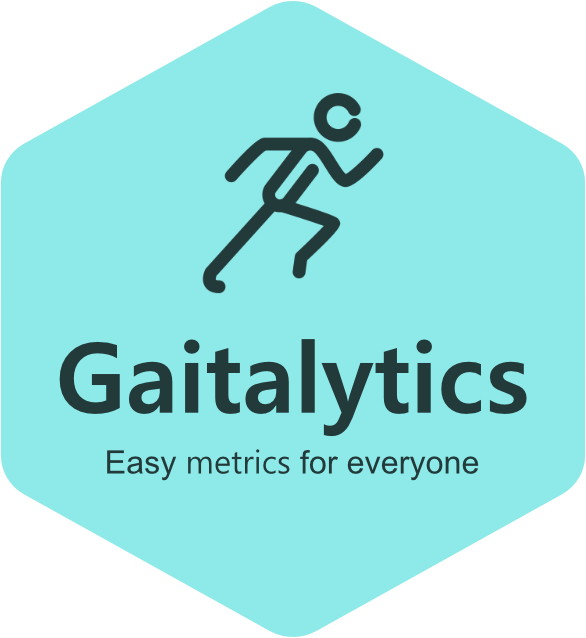

.. meta::
   :description: Gaitalytics is a Python library for easy gait-metrics for everyone.
   :keywords: gaitalytics, gait-analysis, mocap, c3d, gait-metrics, biomechanics, time-series, data-analysis, data, gait

.. include:: ../README.rst

.. toctree::
   :maxdepth: 2
   :hidden:

   usage/index
   api
   reference/index
   contributing
   authors
   changelog

