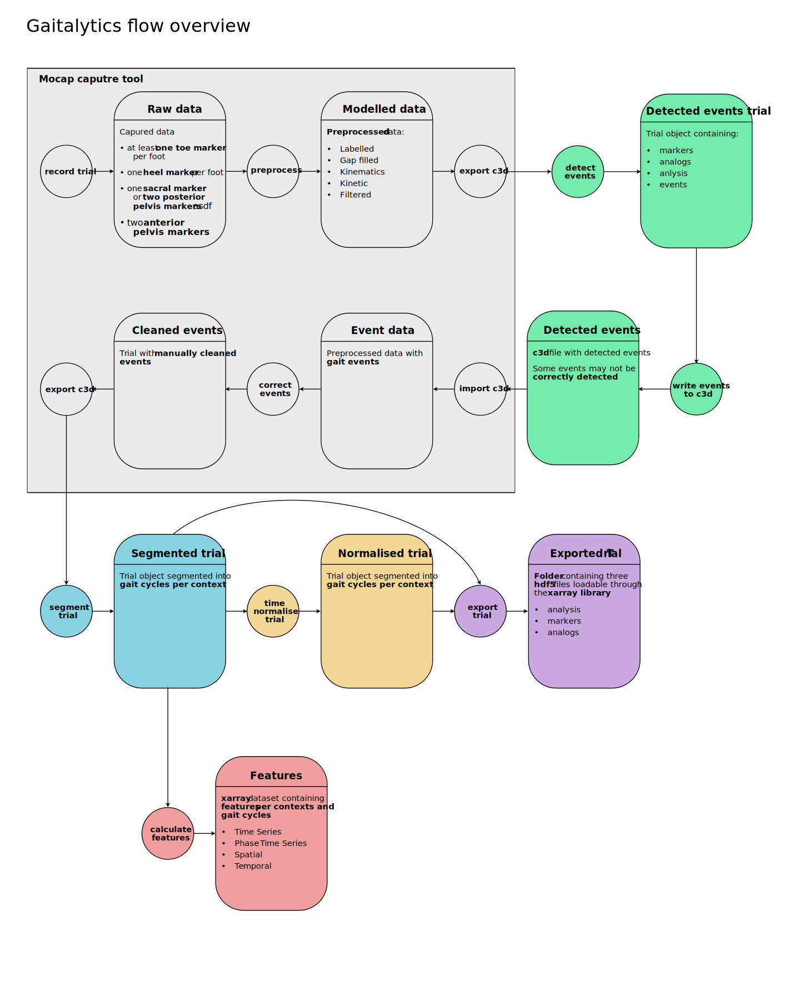

Overview
========

Getting started with Gaitalytics needs some understanding of processes and flows which this framework follows.
Following overview will help you get started with necessary steps to process your data.

As shown in the above image, Gaitalytics is a framework which is designed to process motion data and extract useful metrics from it.
It takes care of following steps in the processing pipeline:

    1. Data Loading
    2. Event Detection
    3. Data segmentation
    4. Feature Calculation
    5. Segment normalization

Each of these steps are explained in detail in the following pages.

.. toctree::
   :maxdepth: 2
   :hidden:

   data_loading
   event_detection
..

